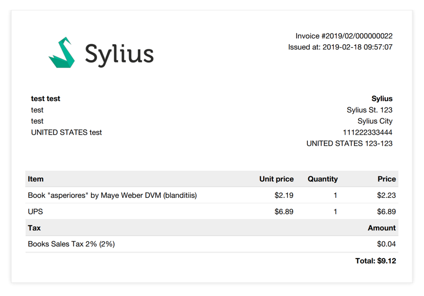
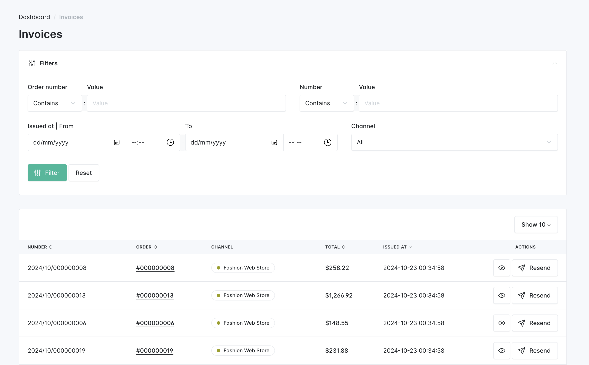

<p align="center">
    <a href="https://sylius.com" target="_blank">
        <picture>
          <source media="(prefers-color-scheme: dark)" srcset="https://media.sylius.com/sylius-logo-800-dark.png">
          <source media="(prefers-color-scheme: light)" srcset="https://media.sylius.com/sylius-logo-800.png">
          
        </picture>
    </a>
</p>

<h1 align="center">Invoicing Plugin</h1>

<p align="center"><a href="https://sylius.com/plugins/" target="_blank"></a></p>

<p align="center">This plugin creates an invoice related to the order.</p>

SyliusInvoicingPlugin creates new immutable invoice when the order is in given state (default: created) and allows
both customer and admin to download invoices related to the order.




## Business value

The primary aim of Invoicing Plugin is to create a document representing Customer's will to buy particular products and
pay for them.

An Invoice can also be treated as a proof of placing an Order. Thus, it is downloadable as .pdf file and can be sent to
Customer manually by the Administrator or automatically once an Order is paid.

Additional feature of the plugin that fulfills Invoicing domain is the ability to set billing data on a Seller.

## Installation

1. Require plugin with composer:

    ```bash
    composer require sylius/invoicing-plugin
    ```

    > Remember to allow community recipes with `composer config extra.symfony.allow-contrib true` or during plugin installation process

2. Apply migrations to your database:

    ```bash
    bin/console doctrine:migrations:migrate
    ```

3. Default configuration assumes enabled PDF file generation. If you don't want to use that feature change your app configuration:

    ```yaml
    # config/packages/sylius_invoicing.yaml
    sylius_invoicing:
        pdf_generator:
            enabled: false
    ```

    Otherwise, check if you have wkhtmltopdf binary. If not, you can download it [here](https://wkhtmltopdf.org/downloads.html).

    In case wkhtmltopdf is not located in `/usr/local/bin/wkhtmltopdf` modify the `WKHTMLTOPDF_PATH` environment variable in the `.env` file:

    ```
    WKHTMLTOPDF_PATH=/usr/local/bin/wkhtmltopdf # Change this! :)
    ```

4. If you want to generate invoices for orders placed before plugin's installation run the following command using your terminal:

   ```bash
   bin/console sylius-invoicing:generate-invoices
   ```

#### Beware!

This installation instruction assumes that you're using Symfony Flex. If you don't, take a look at the
[legacy installation instruction](docs/legacy_installation.md). However, we strongly encourage you to use
Symfony Flex, it's much quicker! :)

## Extension points

Majority of actions contained in SyliusInvoicingPlugin is executed once an event after changing the state of the Order.

Here is the example for `Winzou State Machine`:

```yaml
winzou_state_machine:
    sylius_payment:
        callbacks:
            after:
                sylius_invoicing_plugin_payment_complete_producer:
                    on: ['complete']
                    do: ['@sylius_invoicing_plugin.event_producer.order_payment_paid', '__invoke']
                    args: ['object']
```

Code placed above is a part of configuration placed in `config.yml` file.
You can customize this file by adding new state machine events listeners or editing existing ones.

Here is the example for Symfony's `workflow`:

```xml
<service id="sylius_invoicing_plugin.event_listener.workflow.payment.produce_order_payment_paid"
       class="Sylius\InvoicingPlugin\EventListener\Workflow\Payment\ProduceOrderPaymentPaidListener">
   <argument type="service" id="sylius_invoicing_plugin.event_producer.order_payment_paid" />

   <tag name="kernel.event_listener" event="workflow.sylius_payment.completed.complete" priority="100" />
</service>
```

Apart from that an Invoice model is treated as a Resource.

You can read more about Resources here:

<http://docs.sylius.com/en/latest/components_and_bundles/bundles/SyliusResourceBundle/index.html>.

Hence, template for displaying the list of Invoices is defined in `routing.yml` file:

```yaml
sylius_invoicing_plugin_invoice:
    resource: |
        alias: sylius_invoicing_plugin.invoice
        section: admin
        templates: "@SyliusAdmin\\Crud"
        only: ['index']
        grid: sylius_invoicing_plugin_invoice
        permission: true
        vars:
            all:
                subheader: sylius_invoicing_plugin.ui.manage_invoices
            index:
                icon: inbox
    type: sylius.resource
```

Another aspect that can be both replaced and customized is displaying Invoices list on Order show view.
Code responsible for displaying Invoices related to the Order is injected to existing Sylius template using
Sonata events. You can read about customizing templates via events here:

<http://docs.sylius.com/en/latest/customization/template.html>

### Invoices files

By default, when the order is paid, an immutable Invoice pdf file is saved on the server. The save directory is specified
with `%sylius_invoicing.invoice_save_path%` parameter, that can be overridden if needed.

There is no direct relation between `Sylius\InvoicingPlugin\Entity\Invoice` entity and its file. It's resolved based on
the `Invoice::$number`, which is defined in `Sylius\InvoicingPlugin\Provider\InvoiceFileProviderInterface` service.
By overriding this service, you can change a logic that is used to retrieve the invoice file.

## Fixtures

You can add `ShopBillingData` fixtures into a yaml to add Channel ShopBillingData info to your installation.
More instructions on the [fixtures configuration instructions](docs/fixtures.md).

## Security issues

If you think that you have found a security issue, please do not use the issue tracker and do not post it publicly.
Instead, all security issues must be sent to `security@sylius.com`.
